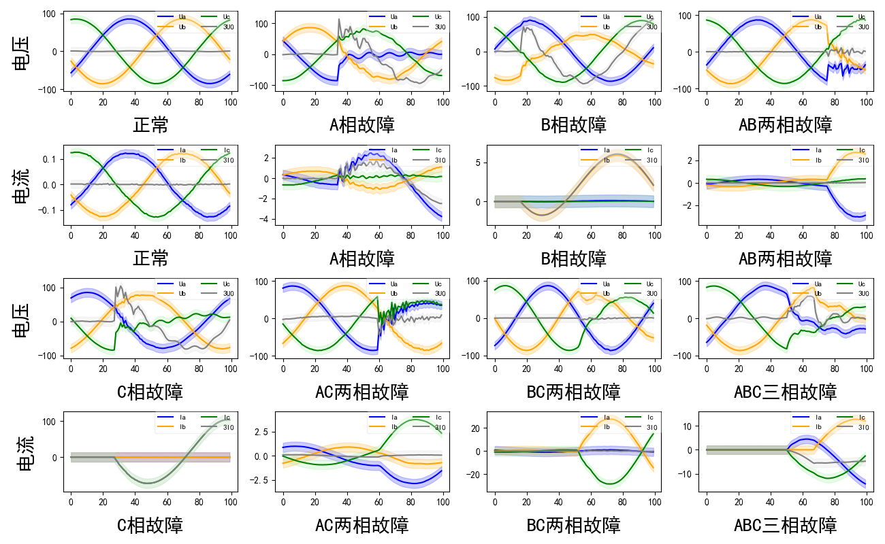
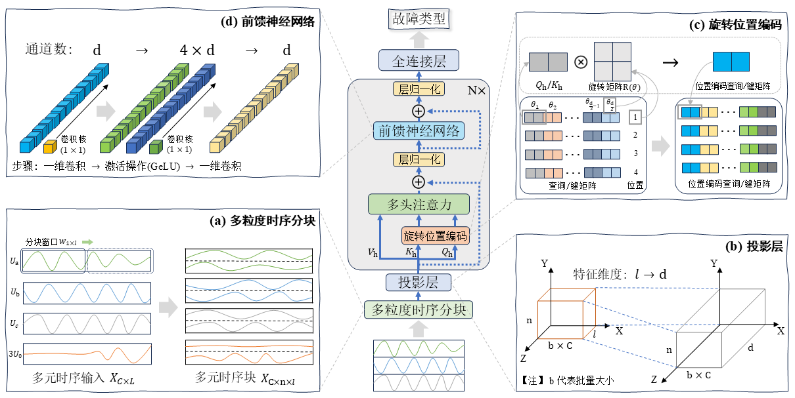

# **基于多粒度时序分块Transformer的电力故障诊断**
PowerGCT(*Power* Multi-*G*ranularity Time Series *C*hunking *T*ransformer)

## 介绍
电力传输线路故障诊断的核心任务是基于实时监测的多元时序信号，快速、准确地识别故障线路及其类型，以支持电网的快速隔离与抢修，保障电力系统的安全稳定运行。具体而言，电力系统中的每条输电线路均配备电流/电压互感器、断路器等监测设备，持续采集A、B、C三相的电流/电压、零序电流/电压以及开关状态等时序信号。当线路发生故障（如单相接地、两相短路、三相短路或高阻故障）时，这些信号会呈现特定的异常模式，例如幅值突变、相位偏移、谐波畸变或零序分量异常。故障诊断系统需实时分析这些信号，完成三个关键步骤：（1）判断是否发生异常；（2）识别具体的故障类型；（3）确定故障发生的具体线路。本文将一条传输线路的时序信号输入构建的诊断模型来判断该线路是正常状态还是某种特定的故障。该任务的挑战在于故障类型的多样性以及毫秒级响应的实时性要求，因此需结合电力系统物理规则、数据预处理和深度学习技术构建高效诊断模型。最终，模型需在保证高准确率（Accuracy > 95%）的同时满足低延迟（Time < 20ms）的工业标准，从而显著缩短故障排查时间，减少停电损失，提升电网的可靠性和修复能力。

## 电力数据集

### 数据预处理
在电力系统中，COMTRADE标准下的故障录波文件记录着多组线路的时序信号，包含存储数据基本信息的CFG配置文件, 存储实际录波数据的DAT数据文件以及带线路参数的DMF模型文件。本文根据CFG和DAT文件读取所有线路记录的时序数据。一个线路对应着三相电流、三相电压以及零序电流/电压，这些信号反映着该线路的健康状况。对于故障样本，本文根据DMF文件中故障线路名字段从读取的所有数据中筛选出故障线路的三相电流电压和零序电流电压，然后再根据故障开始时刻字段从第一次故障开始时刻前一个周期到后一个周期范围里随机截取一个工频周期对应的采样点。值得注意的是，一个工频周期对应的样本点数量作为诊断模型的输入序列长度可以保留故障的周期性特征，同时降低模型计算复杂度。对于正常样本，本文从录波开始时刻到第一次故障开始时刻范围里随机截取一个工频周期对应的采样点。此外，真实场景存在的气候、磁场等外界干扰会导致电信号扰动呈现假性故障。为了让诊断模型学习到此类干扰特征模式，本文将第一次故障开始时刻之前出现的扰动信号波段添加到正常样本中，以此来提高模型在实际情况中的鲁棒性。

### 数据示例


## PowerGCT模型结构



## 训练&推理

运行之前，安装依赖包
```shell
cd PowerGCT
pip install -r requirements.txt
```

### Training

```python
python train.py
```

### Inference

```python
python inference.py
```
或者
```shell
sh ./scripts/run.sh
```
